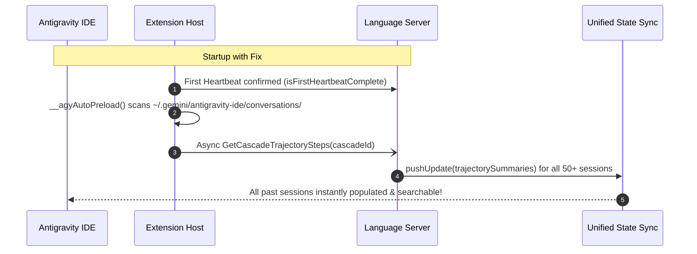

# Antigravity IDE History Restorer & Auto-Preloader 🚀

[](LICENSE)
[]()
[]()

> Permanent fix for disappearing conversation history and lazy-loading dropouts in Google Antigravity IDE.

---

## 📌 The Problem
In **Google Antigravity IDE**, users frequently experience an issue where past conversation histories (often 50+ sessions) disappear from the **"Search all convos..."** quick switcher after restarting the IDE.

### Why does this happen?
1. **Lazy Loading**: The background Go `Language Server` does not load stored `.db` / `.pb` conversation trajectories from `~/.gemini/antigravity-ide/conversations/` on cold boot.
2. **State Sync Overwrite**: When the Language Server initializes, it publishes its empty in-memory state to the Unified State Sync (USS) topic `trajectorySummaries`, replacing the UI cache.
3. **Ghost "Running" Items**: Conversations without a generated title get trapped with `not_fully_idle = true`, causing an invisible button to render in the "Running" section.

---

## ⚡ The Solution
This tool injects a lightweight, non-blocking asynchronous preloader (`__agyAutoPreload`) directly into the Antigravity Extension Host (`extension.js`). 

Upon every IDE startup or Language Server restart, it automatically discovers all saved `.db` and `.pb` sessions and registers them in the Language Server via local ConnectRPC in under **100ms**, keeping all your chat history permanently searchable!

---

## 🚀 1-Step Automatic Installation

### Option A: Via Python (Recommended)
```bash
python fix_antigravity_history.py
```

### Option B: Via PowerShell (Windows)
```powershell
irm https://raw.githubusercontent.com/PyStOspmt/antigravity-chat-history-fix/main/fix.ps1 | iex
```

---

## 🛠️ Technical Deep Dive



---

## 📜 License
MIT License. Free to use and distribute.
